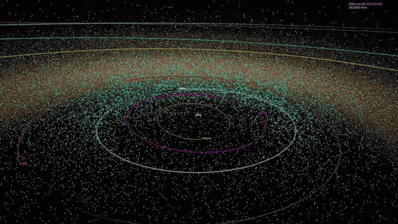
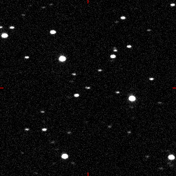

# **NEO (Near-Earth Objects) PHA Classification**
## Machine Learning model prediction

### **Known Near Earth Objects**

Source: Wikepedia

## **Goal**
To predict the potentially hazardous asteroid from the Near earth objects data feed available on NASA's public API. The ML model will predict the potentially hazardous asteroids or PHA's by training different ML algorithms on multiple asteroids attributes.

## **Setup Instructions**
- In order to use the code in `neo_classification` Jupyter notebook you will need to obtain an apiKey from NASA Public api and update it in the `dl.cfg` repository file.
- Also, you can use the default start and end date to obtain the desired data in the code or use the default dates to train the model on that data.

## **Project Concept**

*Wikepedia :*
https://en.wikipedia.org/wiki/Near-Earth_object

*theSkylive.com*
https://theskylive.com/near-earth-objects

### **Flyby of asteroid 2004 FH (centre dot being followed by the sequence)**

## **Data Source**

https://api.nasa.gov/